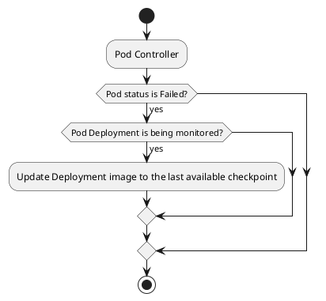

+++
date = '2025-04-28T21:11:34-03:00'
draft = true
title = 'Kubernetes Checkpoint Restore Operator Restoring'
+++

# Kubernetes Checkpoint Restore Operator

In the [blog post](/posts/kubernetes-checkpoint-restore-operator-checkpointing) we created an operator for Kubernetes that enable us to checkpoint Deployment Pods. The operator will schedule periodical checkpoints of the Deployment Pods. There was the missing part of restoring the Pod with the checkpoint data when the Pod fails. A Stateful application in Kubernetes do not persist its state between restarts, so we need to restore the Pod with the checkpoint data in order to restore it from the last known state.

In this post I will be creating the part for restoring a Pod after its fail using the checkpoint generated in the previous post.

## Restoring a Pod after its fail

When a Pod fails it will lose the internal state, mainly the process memory. By using the image we generate from a checkpoint we can recover the Pod with the checkpoint memory state. In the previous post we generated the image, now we must use the same image when the Pod restarts. The restart of a Pod happens because of failures in the container or conditions to kill the Pod, like a memory limit exceeded. It will then restart the Pod container with the image defined at the Deployment specification. We can use the same strategy with controllers we have used so far.

We are going to create e Pod controller that will reconcile the Pods we must monitor, Pods from the monitored Deployments. When a Pod fails for any reason in this monitored deployment, remember we are covering only Deployments with one replica right now, we must change the Image of the deployment to the last checkpoint image. Now, when the Pod restarts it will be using the checkpoint image. Unfortunately, this can have a drawback, something like this can happen:

1. The Pod container fails and the container restarts.
2. We receive the Pod in the reconcile loop of the Pod controller.
3. The Pod restarts with the first image and start handling requests with an empty state.
4. The Pod controller changes the image to the checkpointed one.
5. The Pod restarts and start handling requests with the checkpointed state.

This will generate a weird behavior on the user side that can generate confusion on the requests performed. We could add a sidecar container to every monitored Pod containing a proxy to the Pod original container image. This sidecar proxy would block any requests to the Pod container until the checkpointed image would be available. Another solution could be the usage of a cold replica, another Deployment with the latest checkpoint ready to assume the place of the original Deployment, this would work like this:

1. The user creates a monitored Deployment.
2. The Checkpoint/Restore Operator creates a new checkpoint from the Deployment's Pod.
3. The Checkpoint/Restore Operator creates a new Deployment with the latest checkpoint.
4. The monitored Deployment fails.
5. The Checkpoint/Restore Operator would start to proxy traffic from the first Deployment, changing a Service, for example, to the 2nd Deployment.
6. The 2nd Deployment would become the hot replica and the 1st Deployment would become the cold replica.

This could go over and over again in a cycle. It is an elegant solution that could have some operational overload. We are going to explore both solutions later, the sidecar container and the cold replica in later posts. Now, we are going to use the simpler option that is changing the Deployment Pod container image when it fails, this would cause some downtime and inconsistencies when the restore process in underway. So, we must track the time it takes for a Pod to restore and the actions we have to take in order to restore the Pod.

## Detecting the fail of the Pod

As the last section described, we are going to use a Pod controller to listen for Pod fails. This controller will have a reconcile loop that will work as the diagram below:



By updating the Deployment image to the last checkpointed image the Pod will restart with the last checkpoint state. The code to implement this reconcile loop is shown below:

```go
```