+++
date = '2025-09-15T06:33:12-03:00'
draft = false
title = 'Build a highly availability task scheduler with PostgreSQL'
description = 'Building a highly availability task scheduler using leader and followers pattern with PostgreSQL locks.'
+++

I have always liked to investigate how big systems, like container platforms, databases and caches. It is something that is always helpful to exercise concepts you usually know at scale. One of these systems is a task scheduler, a tool that enable its users to schedule or create a cron schedule for a task that will be performed by the system in the future. The scale of this type of systems can come up to thousands of requests per minute as many applications need tasks to perform routine operations.

This post details the first step in building a highly available task scheduler capable of handling thousands of requests per minute. We will achieve this by decoupling application components and using a leader/follower pattern for the core scheduling engine. This initial implementation uses PostgreSQL tables and locks for leader election — a simple and effective starting point. Future posts will explore more robust solutions like etcd/Zookeeper and Consistent Hashing.

Let's review the pros and cons of using PostgreSQL for leader election:

* Pros: It is simple to implement which can be handy to run on local environment and has low operational overhead as the database is already running to hand data.
* Cons: The database is a single point of failure, unreliable under network latency, and have scalability issues.

## Requirements

In order to develop this system we must come up with the requirements of the application. My application has the following requirements:

1. Users should be able to register and login.
2. Users should be able to create tasks that will request a server using HTTP. The task receives the method used, the headers and the body content.
3. Tasks can be either periodic, which receives a cron schedule, and scheduled which receives a fixed date to be executed.
4. Tasks can be retried following a default policy or a custom retry policy specified by the user.
5. We should be able to check every execution history for every task.

Our key non-functional requirement, which will drive most of our architectural decisions, is that the system must support **thousands of task executions per minute**.

## Design

The first step in our design is the data model. A critical decision is to separate the static task definition from its dynamic schedule. This leads to three core entities: `Task`, `TaskSchedule`, and `TaskExecution`.

*   **Task:** Holds the immutable metadata of a job, such as the HTTP payload and retry policy.
*   **TaskSchedule:** Represents a single, specific run of a task. For a recurring task, a new `TaskSchedule` is created for each run (e.g., every day at midnight).
*   **TaskExecution:** Records the outcome of a `TaskSchedule` attempt, including status, duration, and output.

This separation is crucial for performance. The scheduling engine only needs to query the lean `TaskExecution` table for upcoming jobs, avoiding the overhead of loading the larger, static `Task` metadata for every check. The initial data model is as follows:

<!--
```plantuml
class Task {
	+ ID : uuid.UUID
	+ UserID : uuid.UUID
	+ CreatedAt : time.Time
	+ UpdatedAt : time.Time
	+ Type : TaskType
	+ RunAt : *time.Time
	+ Schedule : *string
	+ Payload HTTPPayload
	+ RetryPolicy : *RetryPolicy
}

class TaskSchedule {
	+ ID : uuid.UUID
	+ TaskID : uuid.UUID
	+ ScheduledTo : time.Time
	+ PartitionID : int
	+ Status : TaskScheduleStatus
	+ CreatedAt : time.Time
	+ UpdatedAt : time.Time
}

class TaskExecution {
	+ ID : uuid.UUID
	+ TaskID : uuid.UUID
	+ TaskScheduleID : uuid.UUID
	+ Status : TaskExecutionStatus
	+ ExecutedAt : time.Time
	+ DurationMs : int
	+ Output : string
	+ CreatedAt : time.Time
}

Task "1" -- "0..*" TaskSchedule : has
Task "1" -- "0..*" TaskExecution : has
TaskSchedule "1" -- "1" TaskExecution : results in

```
-->


## System Architecture

To meet our non-functional requirement, we can't rely on a single monolithic application. We need a distributed, highly available system. We'll separate our system into three main, independently scalable components, communicating via an event-driven architecture using a message broker (like RabbitMQ or Kafka).

1.  **API Server:** A standard REST server where users manage their tasks (create, update, view history). When a task is created or modified, it publishes an event to the broker.
2.  **Consumers:** A set of background services that listen for events and perform database operations. For example, a `TaskCreated` event triggers a consumer to generate the corresponding `TaskSchedule` records. This offloads work from the main API server.
3.  **Scheduler Engine:** The heart of the system. This component is responsible for finding `TaskExecution` records that are due, publishing them as "execution" events, and handing them off to workers.

This approach for the issue results in the following architecture:

```plantuml
@startuml
actor User

User -> Server

frame Server {
    node RESTServer
}

frame Consumer {
    node CreateExecution
    node CreateSchedule
    node ReescheduleExecution
    node ExecutionProjection
}

frame Engine {
    node Scheduler
    node Worker
}

process Broker
database DB

Server -> DB
Consumer -> DB
Engine -> DB

Server -> Broker
Consumer -> Broker
Broker -> Consumer
Engine -> Broker
Broker -> Engine

@enduml
``` -->

![Task Scheduler Architecture](/posts/images/task-scheduler-architecture.png)

We can also see the architecture as three "contexts":

1. Task
2. TaskSchedule
3. TaskExecution

Where each context would handle the related aggregate.

<!-- 
```plantuml
@startmul

cloud Task {
    node RESTServer
}

cloud TaskSchedule {
    node CreateSchedule
    node ExecutionProjection
}

cloud TaskScheduleExecution {
    node CreateExecution
    node ReescheduleExecution
    node Scheduler
    node Worker
}
@enduml
``` -->

![Task Scheduler Contexts Architecture](/posts/images/task-scheduler-contexts-architecture.png)

### Scaling for High Throughput: Data Partitioning

With potentially millions of tasks scheduled daily, both the `TaskSchedule` and `TaskExecution` tables will grow enormous. A simple `SELECT * FROM task_schedule_executions WHERE scheduled_to <= NOW()` would quickly become a performance bottleneck.

To solve this, we can partition the data. A common strategy is to partition the table by a time-based key. For our load of ~30,000 executions per minute, we can create partitions for every hour, this will decrease the amount of tasks in each partition. Partitioning by the minute would create many partitions which would increase the load on the system for writes. The `Scheduler Engine` can then query only the specific, small partitions relevant to the current time, dramatically speeding up reads.

To demonstrate the impact, let's compare query performance on a table with ~40 million rows.

**Without Partitioning:** A query scanning for jobs in a 30-minute window on a single, large table takes around 160ms. The planner must scan a massive index to find the relevant rows.

```sql
                                                                                QUERY PLAN
---------------------------------------------------------------------------------------------------------------------------------------------------------------------------
 Index Scan using task_schedules_copy_scheduled_to_idx on task_schedules_copy  (cost=0.44..19150.19 rows=389775 width=68) (actual time=0.015..147.694 rows=415296 loops=1)
   Index Cond: ((scheduled_to >= '2025-10-23 00:00:00'::timestamp without time zone) AND (scheduled_to <= '2025-10-23 00:30:00'::timestamp without time zone))
   Filter: (((status)::text = 'PENDING'::text) AND (partition_id = 1))
 Planning Time: 0.107 ms
 Execution Time: 159.366 ms
(5 rows)
```

<!-- 


**With Hourly Partitioning**: The same query now targets a much smaller partition. The execution time drops to just around 110ms.

```sql
                                                                                QUERY PLAN
---------------------------------------------------------------------------------------------------------------------------------------------------------------------
 Bitmap Heap Scan on task_schedules_h2025102300 task_schedules  (cost=7234.83..29819.49 rows=430283 width=68) (actual time=16.538..99.075 rows=415296 loops=1)
   Recheck Cond: ((scheduled_to >= '2025-10-23 00:00:00'::timestamp without time zone) AND (scheduled_to <= '2025-10-23 00:30:00'::timestamp without time zone))
   Filter: (((status)::text = 'PENDING'::text) AND (partition_id = 1))
   Heap Blocks: exact=13386
   ->  Bitmap Index Scan on task_schedules_h2025102300_scheduled_to_idx  (cost=0.00..7127.26 rows=430283 width=0) (actual time=15.385..15.385 rows=415296 loops=1)
         Index Cond: ((scheduled_to >= '2025-10-23 00:00:00'::timestamp without time zone) AND (scheduled_to <= '2025-10-23 00:30:00'::timestamp without time zone))
 Planning Time: 0.459 ms
 Execution Time: 110.948 ms
(8 rows)
```

Although the execution times might seem similar at a glance, a statistical significance test confirms a meaningful difference. We collected 30 samples from each query execution and the analysis is as follows:

| Metric | Partitioned | Unpartitioned |
|-----------------|--------------------------|----------------------------|
| Mean | 95.271 ms | 173.363 ms |
| Median (p50) | 93.241 ms | 171.038 ms |
| Std. Deviation | 8.076 ms | 12.952 ms |
| Min / Max | 92.384 ms / 134.027 ms | 162.768 ms / 229.455 ms |
| 95th Percentile | 103.977 ms | 188.203 ms |

By applying the `t-test` we reached a t value of -28.0232 and a p-value of 0, as the p value is less than 0.05, we accept the hypothesis that the two set of data have significant differences.

So, using the 95th percentile for comparisons we have reached a decrease in execution time of 44.75%, which is great for the current time. In productions environment we would have more data in the tables and more disperse data, which would speedup even more.

This partitioning allows the active "hot" data to be managed efficiently by the Scheduler Engine, while older "cold" data can be archived or moved to a separate database for historical analysis without impacting scheduling performance.

### Ensuring High Availability: The Leader/Follower Pattern

The Scheduler Engine is a critical component; if it goes down, no tasks get executed. Running a single instance creates a single point of failure. The solution is to run multiple replicas of the engine.

However, this introduces a new problem: how do we prevent multiple replicas from fetching and executing the same task? We solve this by implementing a **leader/follower** pattern. Only one replica, the **leader**, is responsible for assigning work. The other replicas are **followers**, ready to take over if the leader fails.

In our design, the leader's job is to assign `PartitionID`s to the available worker replicas (including itself). Each replica is then responsible for querying only the `TaskExecution` partitions assigned to it. This way, the workload is distributed, and no two replicas will ever process the same task.

### Leader Election with PostgreSQL

Now, we need a mechanism for the replicas to agree on who the leader is. While tools like Zookeeper or etcd are built for this, we can start with a simpler approach using our existing PostgreSQL database.

We have implemented the leader election using a table in PostgreSQL. When a replica wants to be elected as leader, it shold retrieve the lock for the data, using a `FOR UPDATE`, and update the entry. The process is as follows:

1.  **Leader Election:** All replicas attempt to acquire a specific lock over an entry in a table by using a `FOR UPDATE` in a `SELECT`. This block two replicas to update the same row. Once they get the lock, they check if the leader lease has expired and become the new leader. If the leader lease has not expired, nothing happens.
2.  **Leader Duty:** The leader periodically renews its lease by updating the table with the latest lease timestamp. It also monitors the health of followers and assigns partitions to them.
3.  **Follower Duty:** Followers periodically attempt to acquire the lock. If they fail, they know a leader exists and continue their follower duties (processing tasks in their assigned partitions). If they succeed, they become the new leader.
4.  **Health Checks:** To know which followers are active, each follower periodically updates a "last seen" timestamp in a registry table. The leader uses this table to distribute partitions only among healthy followers. If a follower's timestamp becomes too old, the leader reclaims its partitions and redistributes them.

The sequence diagram below represents this process in the code:


This database-centric approach has the cons we listed earlier (single point of failure, latency sensitivity), but it's an excellent, low-overhead way to implement leader election for an initial version.

## Conclusion

In this post, we designed a highly available task scheduler. We started with clear requirements and a data model that separates static task definitions from their dynamic schedules for performance. We then outlined a distributed, event-driven architecture to handle high throughput.

To ensure availability, we chose a leader/follower pattern for our core scheduling engine and detailed a simple but effective leader election mechanism using PostgreSQL tables and locks. While this approach has trade-offs, it provides a solid foundation for our system.

In the next post, we will explore more robust coordination services like etcd and Zookeeper to overcome the limitations of the PostgreSQL-based approach.
